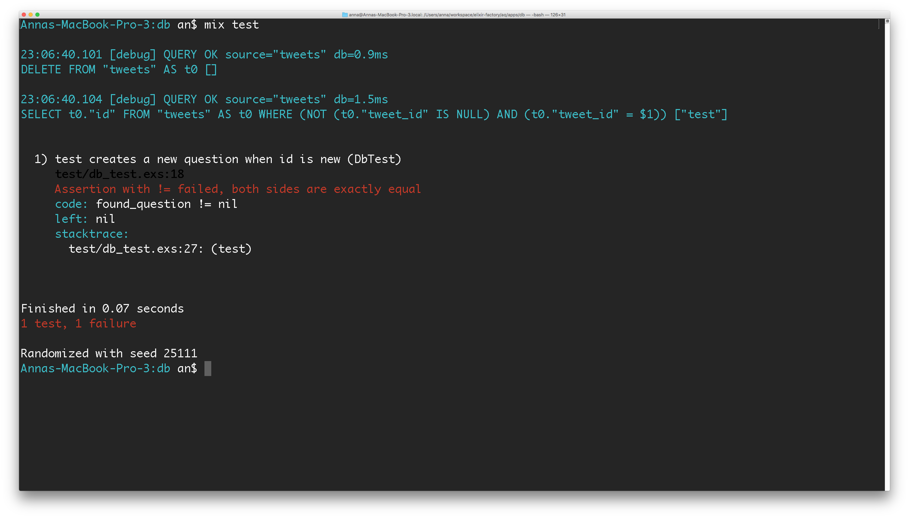
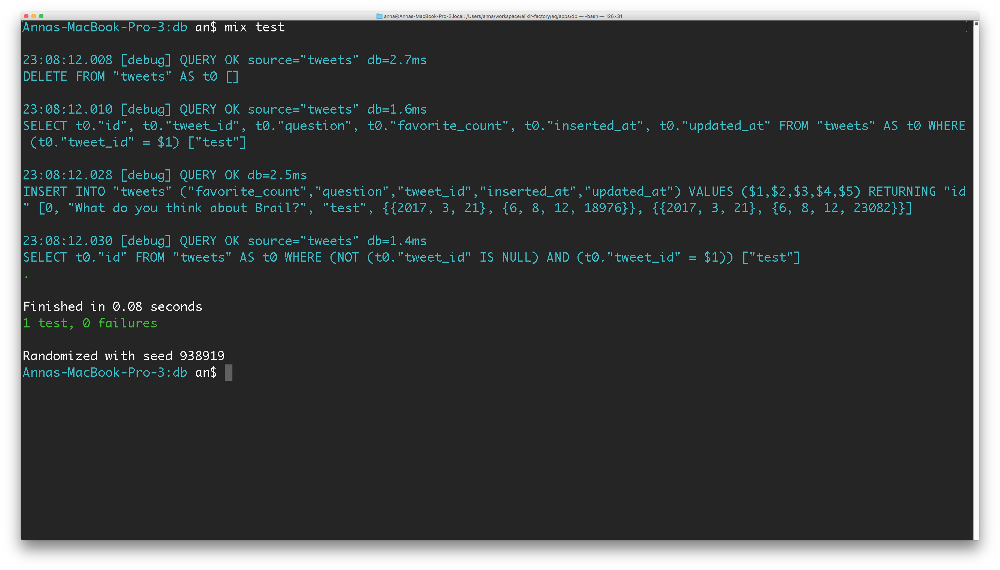
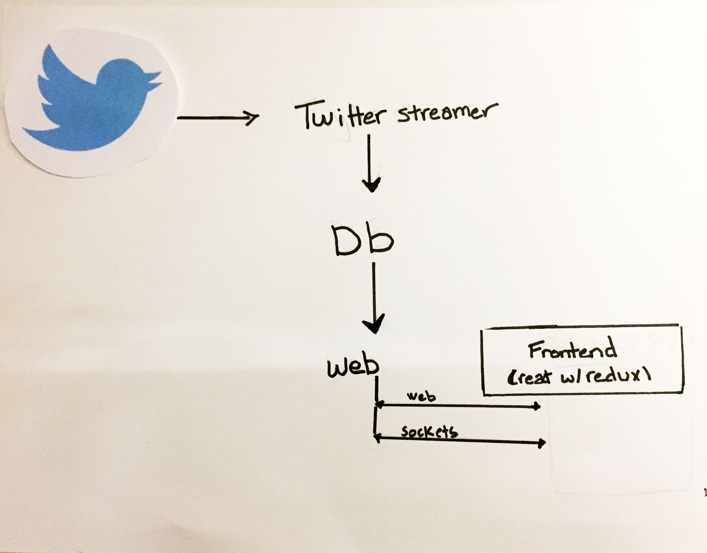

name: Title
class: font-title


How we write better programs with Elixir

---
name: Who are we
class: font-title

Who are we?

---
name: Ari + Anna
class: font-title
Ari + Anna

---
name: Ginger
class: font-title


---
name: elixir helps us
class: font-title

How elixir helps us write better software

---
name: elixabot
class: font-title

# #Elixabot

---
name: quick prototyping
class: code_slide

.font-title[Quick Prototyping]

Fun Fact - 1.5 working days to real-time system.
---
name: what we used  
class: font-title

 Twitter + Sockets + React

  ~~No framework~~

---
name: how did we accomplish that?
class: font-title

How did we accomplish that?

---
name: how did we accomplish that?
class: font-title

Elixir gave us that power

---
name: Elixir gives us power
class: font-title

Like any good app, we want to do design driven development

---
name: how did we accomplish that?
class: font-title

Umbrella apps force quality design

---
name: What does that get us
class: font-title

What does this way get us?

---
name: small modules
class: font-title

Small Modules\
Isolated Functionality

---
name: Dependency Management
class: font-title

Dependency Management

---
name: Dependency Management
class: font-title

TDD/BDD

---
name: Dependency Management
class: font-title

Features of a monolithic app

 +

Benefits of microservices
---
name: What do we need?
class: font-title
To build this app, what do we need?

---
name: Our 3 apps
class: font-title

A Twytter streamer

+

A web interface

+

A Database
---
name: So let's get started
class: font-title

So let's get started
---
name: Mix Build tool
class: font-title

We use the mix build tool

to create our app

---
name: Current App
class: font-title

Looking at our current app you see...

---


---
name: Set up DB
class: font-title

Let's set up our DB app
---
name: Save tweets and update votes
class: font-title

It will save tweets + update vote counts

---
name: Need dependencies
class: font-title

To start we need our dependencies.

---
name: Postgres + ecto
class: font-title

`postgres` + `ecto`

---
name: Show deps
background-color: black

Let's add these to our mix.exs file

```elixir
  defp deps(_) do
    [
      {:postgrex, "~> 0.13.2"},
      {:ecto, "~> 2.1"}
    ]
  end  
```
```bash
mix deps.get
```

---
name: manage deps
class: font-title

Mix makes it super easy to manage dependencies

---
name: conflict less likely
class: font-title

Which means conflict is less likely

---
name: resolution easier
class: font-title

And resolution is easier

---
name: resolution easier
class: font-title

Smarter tools allow us to build smarter apps

---
name: smarter tools
class: font-title

# #smartertools

---
name: what comes with smarter apps
class: font-title

What comes with smarter apps

---
name: tested apps
class: font-title

Tested Apps

---
name: TDD stability
class: font-title

Test Driven Development gives our apps stability

---
name: Dave Thomas
class: font-title

Just Ask Dave Thomas

---
name:  and you can
class: font-title

And you probably can...cause he's here

---
name: testing is core
class: font-title

In Elixir, testing is a core feature

---
name: not an afterthought
class: font-title

It's not an afterthought

---
name: test unit integration
class: font-title

Let's take a look at Test Unit Integration

---
name: db vote count
class: font-title

We want to DB app make sure our vote count is being set accurately

---
name: ensure
class: font-title

How can we ensure that?

---
name: ExUnit
class: font-title

We use ExUnit to Unit test

---
name: db sample
class: font-title
background-color: black


```
test "creates a new question when id is new" do
  Db.Tweet
  .first_or_create(%ExTwitter.Model.Tweet{
    id_str: "test",
    text: "What do you think about Brail?",
    favorite_count: 0
  })

  found_question = Db.Repo.one query_for_tweet(%{id_str: "test"})
  assert found_question != nil
end
```

---
name: failing test
class: font-title




---
name: failing test 1
class: font-title

Now that we have a failing test

---
name: passing test
class: font-title

Then we implement the functionality to make it pass

---
name: passing test 1
class: font-title
background-color: black

```elixir
  def first_or_create(tweet) do
    query = from t in Db.Tweet,
            where: t.tweet_id == ^tweet.id_str,
            select: t

    new_tweet = %Db.Tweet{
      tweet_id: tweet.id_str,
      question: tweet.text,
      favorite_count: tweet.favorite_count
    }
    case Db.Repo.one(query) do
      nil ->
        {:ok, saved_tweet} = Db.Repo.insert(new_tweet) # Create tweet
        saved_tweet
      model -> model
    end
  end
```  

---
name: passing tests 2
class: font-title





---
name: confident code
class: font-title


This gives us the confidence that our code is working

---
name: Twytter
class: font-title

Before we move on to our Twytter app
---
name: powerful feature elixir
class: font-title

let's take a look at Pattern Matching
---
name: pattern matching example
class: font-title
background-color: black

```elixir
defp create_tweet({ nil, tweet }) do
  new_tweet = %Db.Tweet{
    tweet_id: tweet.id_str,
    question: tweet.text,
    favorite_count: tweet.favorite_count
  }

  {:ok, saved_tweet} = Db.Repo.insert(new_tweet)
  saved_tweet
end

defp create_tweet({ instance, _ }), do: instance
```
---
name: important
class: font-title

Why is this important?

---
name: pattern matching
class: font-title

Easily understandable as to what is going on

---
name: pattern matching
class: font-title

Declarative code

---
name: pattern matching
class: font-title

Prevents complicated conditionals

---

Pattern matching allows you to deal with data in small pieces.

---
Let's take a look at our Twytter app

---

Back to our high level diagram

---



---

Let's implement the Twitter streamer

---

... and try not to get banned

---

Pulling from Twitter

---

Fetching tweets with Elixir is easy (Thanks @parroty/ExTwitter)

---

```elixir
tweets = ExTwitter.search(hashtag)
```

---
background-color: black

## With limits

```elixir
opts = [count: demand]
tweets = ExTwitter.search(hashtag, opts)
```

---
background-color: black

2. Persist in DB

```elixir
db_tweet = Db.Tweet.first_or_create(tweet)
db_tweet = Db.Tweet.update_votes(db_tweet, tweet.favorite_count)
```

---
background-color: black

```elixir
jsonable_tweets = tweets |> Enum.map(&to_jsonable/1)
Web.WsServer.broadcast(jsonable_tweets)
```

---
background-color: black

```elixir
def flow(hash_tag) do
  opts = [count: demand]
  tweets = ExTwitter.search(hashtag, opts)
  db_tweet = Db.Tweet.first_or_create(tweet)
  db_tweet = Db.Tweet.update_votes(db_tweet, tweet.favorite_count)
  jsonable_tweets = tweets |> Enum.map(&to_jsonable/1)
  Web.WsServer.broadcast(jsonable_tweets)
end
```

---
class:
## Lots of problems

.left.middle[* Mixing of concerns
* Difficult to test
* Pulls in a lot of disparate pieces into a monolithic method]

---

## Better way?

---

## GenStage

---

Looking at the design

---


---

Yet what if we flipped the direction of the flow?

---


---
## GenStage goes backwards

---

Backpressure / control

---


---

How is this backwards system setup?

---
background-color: black

```elixir
{:ok, producer} = GenStage.start_link(TweetService, "#elixabot")
{:ok, prod_con} = GenStage.start_link(TweetProdConsumer, :ok)
{:ok, consumer} = GenStage.start_link(TweetConsumer, :ok)

GenStage.sync_subscribe(prod_con, to: producer, max_demand: 10)
GenStage.sync_subscribe(consumer, to: prod_con, max_demand: 5)
```

---
class: show_genstage

<ul class="genstage">
  <li class="stage">Twitter</li>
  <li class="stage">DB</li>
  <li class="stage active">Web</li>

</ul>

## Web (tweet consumer)

---
class: show_genstage

<ul class="genstage">
  <li class="stage">Twitter</li>
  <li class="stage">DB</li>
  <li class="stage active">Web</li>
</ul>

Since we want to play nice to Twitter, we need to control our desires... aka manage demand pressure

---
class: show_genstage code_slide
background-color: black

<ul class="genstage">
  <li class="stage">Twitter</li>
  <li class="stage">DB</li>
  <li class="stage active">Web</li>  
</ul>

```elixir
def handle_subscribe(:producer, opts, from, producers) do
  pending = opts[:max_demand] || 5
  interval = opts[:interval] || 90000

  producers = Map.put(producers, from, {pending, interval})
  producers = ask_and_schedule(producers, from)

  {:manual, producers}
end
```

---
class: show_genstage
background-color: black

<ul class="genstage">
  <li class="stage">Twitter</li>
  <li class="stage">DB</li>
  <li class="stage active">Web</li>  
</ul>

```elixir
defmodule Twytter.TweetConsumer do
  require Web.WsServer

  use GenStage

  def handle_events(events, from, producers) do
    producers = Map.update!(producers, from, fn {pending, interval} ->
      {pending + length(events), interval}
    end)

    jsonable_tweets = events |> Enum.map(&to_jsonable/1)
    Web.WsServer.broadcast(jsonable_tweets)

    {:noreply, [], producers}
  end
end
```

---
class: show_genstage

<ul class="genstage">
  <li class="stage">Twitter</li>
  <li class="stage active">DB</li>
  <li class="stage">Web</li>
</ul>

## DB Producer Consumer

---
class: show_genstage
background-color: black

<ul class="genstage">
  <li class="stage">Twitter</li>
  <li class="stage active">DB</li>
  <li class="stage">Web</li>
</ul>

```elixir
defmodule Twytter.TweetProdConsumer do
  require Db.Tweet
  use GenStage

  defp get_record(tweet) do
    db_tweet = Db.Tweet.first_or_create(tweet)
    Db.Tweet.update_votes(db_tweet, tweet.favorite_count)
  end

  def handle_events(tweets, _from,  _state) do
     processed_tweets = tweets |> Enum.map(&get_record/1)
    {:noreply, processed_tweets, :ok}
  end
end
```

---

Now, to get the tweets (Finally)

---
class: show_genstage
background-color: black

<ul class="genstage">
  <li class="stage active">Twitter</li>
  <li class="stage">DB</li>
  <li class="stage">Web</li>
</ul>

```elixir
defmodule Twytter.TweetService do
  use GenStage

  def handle_demand(demand, %{
  	hashtag: hashtag,
    last_tweet: last_tweet}) do

    opts = [count: demand]
    opts = case last_tweet do
      %ExTwitter.Model.Tweet{id_str: id} -> Keyword.put(opts, :since_id, id)
      _ -> opts
    end

    tweets = ExTwitter.search(hashtag, opts)
    last_tweet = List.last(tweets)

    {:noreply, tweets, %{last_tweet: last_tweet, hashtag: hashtag}}
  end
end
```

---

Our _flow_ is missing one piece

---

## Web

---

We'll use the fantastic `Cowboy` connection pooling library

---
background-color: black

```elixir
defp deps(_) do
  [
    {:cowboy, "~> 1.1"},
    {:plug, "~> 1.3"},
    {:poison, "~> 2.0"}
  ]
end
```

---
background-color: black

```elixir
Plug.Adapters.Cowboy.child_spec(
  :http, Web.Router, [], [
    port: 4001,
    dispatch: dispatch()
])
```

```elixir
defp dispatch do
  [
    {:_, [
      {"/ws", Web.SocketHandler, []},
      {:_, Plug.Adapters.Cowboy.Handler, {Web.Router, []}}
    ]}
  ]
end
```

---

Web.Router

---
background-color: black

```elixir
defmodule Web.Router do
  require EEx

  plug Plug.Static,
    at: "/",
    from: {:web, "priv/static"},
    only: ~w(css js)

  @index_template Application.app_dir(:web, "priv/views/index.html.eex")
  EEx.function_from_file :defp, :template_index, @index_template, [:env]

  get "/" do
    page_contents = template_index(Mix.env)
    conn
    |> Plug.Conn.put_resp_content_type("text/html")
    |> Plug.Conn.send_resp(200, page_contents)
  end

  match _ do
    send_resp(conn, 404, "not found")
  end
end
```

---

Because all the cool kids are doing it...

---
background-color: black

```html
<!doctype html>
<html lang="en">
<head>
    <meta charset="UTF-8">
    <meta name="viewport"
          content="width=device-width, user-scalable=no, initial-scale=1.0, maximum-scale=1.0, minimum-scale=1.0">
    <meta http-equiv="X-UA-Compatible" content="ie=edge">
    <title>Elixabot</title>
</head>
<body>
    <div id="root"></div>
    <%= if env == :dev do %>
      <script src="http://localhost:8080/js/app.js"></script>
    <% else %>
      <script src="/js/app.js"></script>
    <% end %>
</body>
</html>
```

---


.middle.left[* React
* Webpack 2]

---
background-color: black

```js
const publicPath = "http://localhost:8080/"
  const hot = "webpack-hot-middleware/client?path=" +
    publicPath + "__webpack_hmr"

  const entry = {
    app: [
      "js/app.js",
      "css/app.css"
    ]
  }
  if (!(env && env.prod)) {
    // HOT RELOADING!
    entry.app.unshift(hot)
  }
  // ...
}
```

---

## Redux

---
background-color: black

```javascript
export const socketConnect = () => dispatch => {
  dispatch({ type: types.SOCKET_CONNECT });

  const socket = new WebSocket(`ws://localhost:4001/ws`)
  socket.onopen = () => {
    dispatch({ type: types.SOCKET_CONNECTED });
  }

  socket.addEventListener("message", ({ data }) => {
    try {
      dispatch({
        type: types.RECEIVED_QUESTIONS,
        payload: JSON.parse(data)
      })
    } catch (e) {
    }
  })
}
```

---

## What are we connecting to?

---

## Cowboy websocket

---
background-color: black

```elixir
defmodule Web.SocketHandler do
  @behaviour :cowboy_websocket_handler

  def init(_, _req, _opts) do
    Web.WsServer.subscribe()
    {:upgrade, :protocol, :cowboy_websocket}
  end

  def websocket_handle({:text, "ping"}, req, state) do
    {:reply, {:text, "pong"}, req, state}
  end

  def websocket_handle({:message, message}, req, state) do
    {:reply, {:text, message}, req, state}
  end

  # ...
end
```

---

## Sending data from client to server

---
background-color: black

```javascript
socket.send(JSON.stringify({message: "c major"}))
```
```elixir
def websocket_handle(message, req, state) do
  {:text, msg} = message
  {:ok, data} = Poison.decode(msg)
  # Do something with the data
  {:reply, {:text, "OK"}, req, state}
end
```

## Sending server to client

---

## Broadcasting to our connected clients

---

Need to keep track of the connected clients

---
background-color: black

```elixir
supervisor(Registry, [:duplicate, :ws_registry]),
```

---
background-color: black

```elixir
def init(_, _req, _opts) do
  # on socket connect
  Web.WsServer.subscribe()
  {:upgrade, :protocol, :cowboy_websocket}
end
```

---

## Subscribing looks like...

---
background-color: black

```elixir
defmodule Web.WsServer do
  use GenServer

  def start_link(topic, opts \\ []) do
    GenServer.start_link(__MODULE__, topic, opts)
  end

  def subscribe(topic \\ "message") do
    Registry.register(:ws_registry, topic, :socket)
  end
end
```

---
background-color: black

```elixir
def broadcast(data, topic \\ "message") do
  {:ok, msg} = Poison.encode(data)
  Registry.dispatch(:ws_registry, topic, fn entries ->
    for {pid, _} <- entries, do: send(pid, msg)
  end)
end
```

---

Then handle the normal redux workflow. for instance...

---
background-color: black

```javascript
export const reducer = (state = initialState, action) => {
  switch (action.type) {
    case types.RECEIVED_QUESTIONS:
      return {
        ...state,
        list: action.payload,
      }
    default:
      return state
  }
}
```

---

Questions?

---

Thank you!

@auser/@aneyzb
